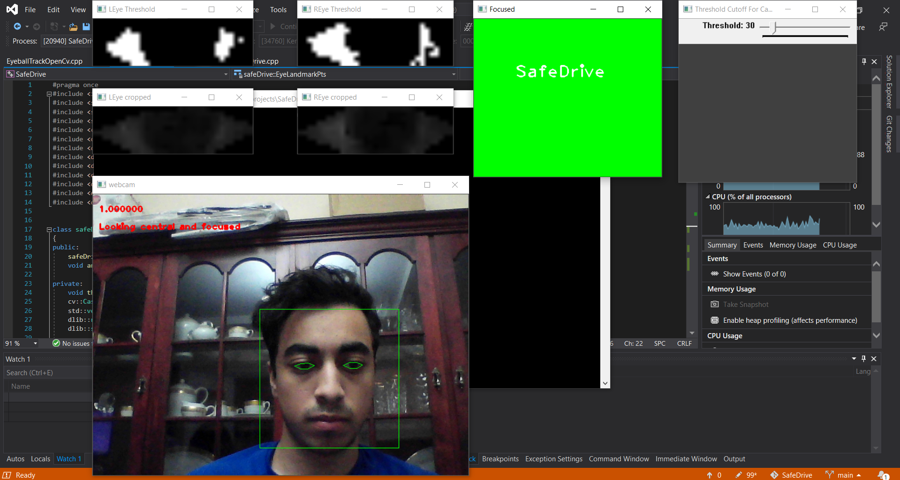

# SafeDrive
C++ Visual Studio solution for driver focus detection using computer vision and image processing.

# Requirements:
 - Windows 10
 - Visual Studio 2019
 - OpenCV 4.5.1
 - dlib 19.21
 
# Usage
 - Install OpenCV 4.5.1 and dlib 19.21 for windows
 - Once you have OpenCV 4.5.1 installed, copy the opencv_world451.dll file to \x64\Release\
 - Open the SafeDrive.sln visual studio solution
 - Check Project Properties and make sure all dependencies paths (OpenCV, dlib) are correct
 - Build the solution on x64 Release mode and run

# Sample Run

  

